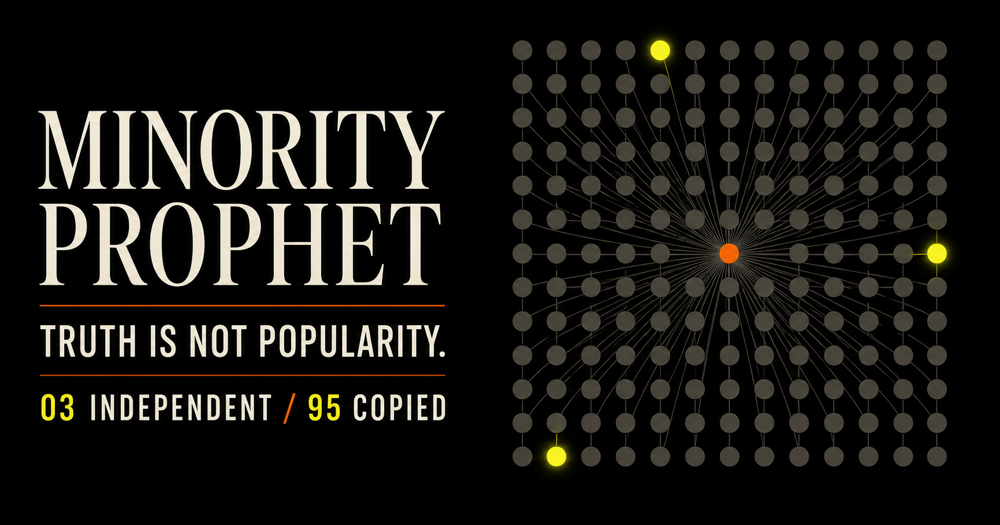

# Minority Prophet

**Count independent evidence, not repeated claims.**



Five agents repeating one source are still one source. Minority Prophet is a
research project, benchmark, and deterministic evidence-structure engine for
testing whether independently grounded minority evidence survives a copied
majority.

It does **not** decide truth, certify sources, or authorize actions. It counts
recorded evidence roots, preserves uncertainty, and exposes where the answer
depends on missing or unreliable lineage.

## Start here

| If you want to… | Go to… |
|---|---|
| Understand the idea in five minutes | [Public claims](PUBLIC-CLAIMS.md) |
| See exactly what is proved, measured, and still unknown | [Evidence status](docs/evidence/STATUS.md) |
| Run the benchmark or engine | [Using Minority Prophet](docs/use/README.md) |
| Inspect the research and preserved results | [Research map](docs/research/README.md) |
| Understand the components and boundaries | [Architecture map](docs/architecture/README.md) |
| Audit claim-to-evidence alignment | [Evidence map](docs/evidence/README.md) |
| Contribute | [Contributor guide](docs/contributing/README.md) |
| Find anything else | [Complete repository map](docs/repository-map.md) |

The [documentation hub](docs/README.md) explains which files are introductions,
which are current sources of truth, and which are immutable historical records.

## The core invariant

> A recorded copy must not gain a new vote.

Photocopying one witness statement does not create more witnesses. In a copied
majority, naive voting sees five votes against one. Root-aware aggregation sees
one recorded source against one independent source and reports the unresolved
structure instead of manufacturing confidence.

This guarantee is conditional. Roots must not be freely forged, opposing claims
must not be merged, and missing lineage must remain unknown. Root identity can
also be [decision-relative](research/decision-relative-independence/README.md):
separate machines may be independent for a compatibility test while sharing one
controller for an operator-consensus question.

## What exists today

| Surface | What it is | Maturity |
|---|---|---|
| [Synthetic benchmark](benchmark/) | Copied-majority worlds and evaluation metrics | Research implementation |
| [Aggregation methods](aggregation/) | Majority, weighted, root-aware, and experimental comparators | Mixed; see each experiment |
| [Provenance graph](provenance/) | Evidence ancestry and root-counting primitives | Tested reference implementation |
| [Formal model](formal/) | Lean proofs and theorem/claim scope | Compiled, narrowly scoped proofs |
| [Research records](research/records/) | Content-bound lifecycle records for experiments | Canonical registry mechanism |
| [Engine runtime](evaluations/multi-model-v1/) | Provider-neutral, read-only MCP/HTTP analysis service | Reference runtime |
| [Website and dashboard](website/) | Public explanation and result views | Public interface |

The shortest honest status is: narrow invariants are proved; large synthetic and
bibliographic measurements exist; real-world provenance recovery and general
truth discovery are **not** established. See [Evidence status](docs/evidence/STATUS.md)
and [Public claims](PUBLIC-CLAIMS.md) before quoting results.

## Try it

```bash
git clone https://github.com/Silentpartnercoding/minority-prophet.git
cd minority-prophet
python -m pip install .
python -m benchmark --worlds 500 --seed 7
python -m experiments.los_inspired_v01
```

For the read-only MCP/HTTP engine:

```bash
npm --prefix evaluations/multi-model-v1 install
MP_ENGINE_ALLOW_INSECURE_LOCAL=1 \
  npm --prefix evaluations/multi-model-v1 exec mp-engine -- doctor
```

The runtime assesses evidence structure only. Installation never authorizes an
agent to perform protected actions. Full setup, API, and verification commands
are in [Using Minority Prophet](docs/use/README.md).

## Research discipline

Negative, incomplete, superseded, and adverse results remain visible. Current
claim authority comes from the [canonical record registry](CANONICAL-RECORDS.md),
[claim-to-record ledger](EVIDENCE-ALIGNMENT.md), and machine-readable
[research records](research/records/), not from how prominent or recent a file
looks.

The current manuscript is available through the stable
[current-paper entry point](papers/00-CURRENT-PAPER.md). Every research
hypothesis must state a null, metric, failure condition, and success condition.

## Project boundaries

Minority Prophet assesses evidence dependence. It does not replace:

- identity, authorization, or action policy;
- world-state verification;
- general agent observability;
- a truth oracle; or
- human judgment about the consequences of acting.

Those boundaries and the relationship to Gate, Border, AgentWEX, and a possible
larger epistemic stack are documented in [System architecture](SYSTEM-ARCHITECTURE.md).

Licensed under the [Apache License 2.0](LICENSE). See [NOTICE](NOTICE) and
[contributors](CONTRIBUTORS.md).
